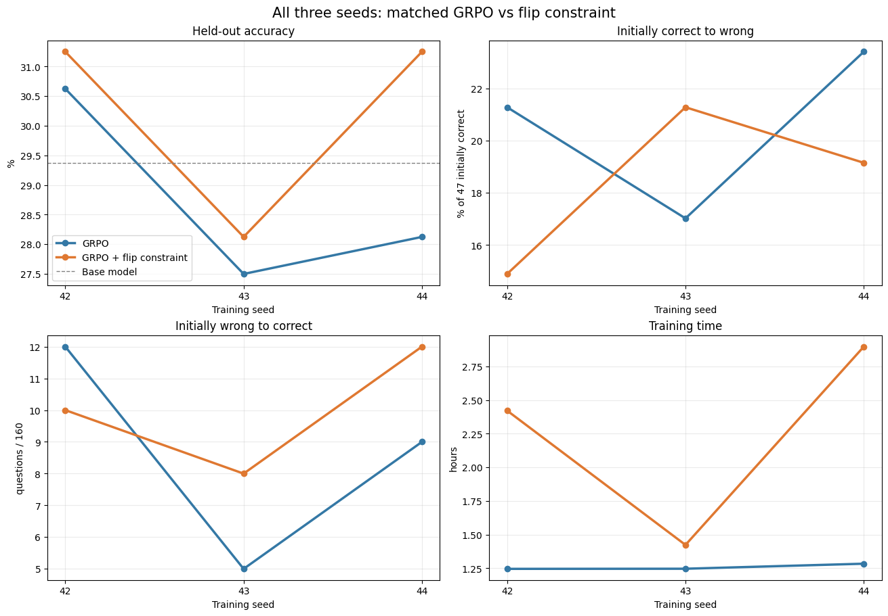

# Báo cáo thí nghiệm: GRPO với ràng buộc mềm hạn chế đúng thành sai trong giải toán

**Dự án:** Post-training Language Models via Constrained Optimization (PLMCO)  
**Trạng thái:** Baseline thăm dò, chưa phải kết luận về hiệu quả tổng quát  
**Mô hình:** Qwen2.5-1.5B-Instruct; hậu huấn luyện bằng QLoRA 4-bit  
**Dữ liệu:** subset đáp án nguyên của MATH, bốn chủ đề  
**Phạm vi kết quả:** seed 42, 43, 44; mỗi seed 64 bước train; cùng 160 bài test

## Tóm tắt

GRPO giúp mô hình ngôn ngữ học từ nhiều lời giải được sinh cho cùng một bài toán. Tuy nhiên, sau hậu huấn luyện, một số bài mà mô hình gốc từng giải đúng lại bị giải sai. Thí nghiệm này khảo sát một biến thể GRPO có cơ chế theo dõi tỷ lệ **đúng thành sai** trên các bài kiểm tra riêng (anchor), rồi tăng hoặc giảm trọng số ôn lời giải chuẩn theo từng chủ đề toán. Đây là **ràng buộc mềm có phản hồi**, không phải ràng buộc cứng hay phép chiếu gradient.

Trên cùng 160 bài test, nhánh ràng buộc đạt 50, 45, 50 bài đúng ở seed 42, 43, 44; GRPO thường đạt 49, 44, 45 bài. Accuracy trung bình lần lượt là **30,21%** và **28,75%**. Tuy nhiên, số bài vốn đúng bị chuyển thành sai của nhánh ràng buộc là 7, 10, 9, so với 10, 8, 11 của GRPO. Do seed 43 đi ngược mục tiêu giảm flip, dữ liệu hiện tại **chưa chứng minh phương pháp bảo vệ kiến thức ổn định**. Thời gian train nhánh ràng buộc trên ba seed khoảng 1,79 lần GRPO.

## 1. Bài toán và động cơ

Mục tiêu ứng dụng là hậu huấn luyện một mô hình ngôn ngữ tổng quát để giải toán ở nhiều chủ đề: đại số, hình học, lý thuyết số, tổ hợp và xác suất. Ta muốn mô hình giải được thêm các bài trước đây làm sai, nhưng cũng muốn tránh làm hỏng những bài nó vốn đã giải đúng.

Với một bài test, có bốn trường hợp khi so mô hình sau train với mô hình gốc: đúng vẫn đúng, sai vẫn sai, sai thành đúng, và đúng thành sai. Trường hợp cuối là **regression** hoặc **flip**. Accuracy tổng thể chỉ phản ánh hiệu số giữa hai hướng đổi trạng thái. Ví dụ, nếu sau train có 12 bài sai thành đúng nhưng 10 bài đúng thành sai, accuracy chỉ tăng ròng 2 bài; mười ca suy giảm vẫn là thông tin quan trọng.

Vấn đề nghiên cứu của baseline này là: **có thể thêm một cơ chế ràng buộc vào quá trình GRPO để hạn chế các ca đúng thành sai mà vẫn giữ được khả năng học bài mới không?** Đây là vấn đề về đánh đổi giữa thích nghi và duy trì năng lực, không phải yêu cầu mô hình tuyệt đối không được sai bài cũ.

## 2. Phạm vi dữ liệu và định nghĩa chỉ số

Nguồn dữ liệu là `HuggingFaceH4/MATH`, cố định tại revision `9bbe1fc38f097a38e3bdf5bbec8d6feee21318c9`. Bộ lọc chỉ giữ những bài có đáp án cuối là **số nguyên** nằm trong `\boxed{...}` và prompt không vượt giới hạn. Vì vậy đây không phải phép đánh giá trên toàn bộ MATH; các đáp án dạng phân số, biểu thức hay tập nghiệm bị loại khỏi baseline này. Đề trùng được kiểm tra khi chuẩn bị split.

Mỗi chủ đề có 16 bài train, 16 bài anchor, 20 bài validation và 40 bài test. Tổng cộng có **64 train, 64 anchor, 80 validation và 160 test**. Các tập không chồng lấn. Mô hình gốc giải đúng 47/160 bài test, tức 29,38%. Trong 47 bài đó, số bài đúng theo chủ đề lần lượt là: đại số 20, hình học 12, lý thuyết số 6, tổ hợp và xác suất 9.

Các chỉ số chính được tính trên **cùng từng bài test**:

- **Accuracy:** số bài có đáp án cuối chính xác chia cho 160. Vì mỗi chủ đề có 40 bài, macro accuracy bốn chủ đề bằng accuracy toàn tập.
- **Đúng thành sai (C→W):** trong 47 bài mô hình gốc giải đúng, đếm số bài model sau train giải sai. Tỷ lệ flip là `C→W / 47`.
- **Sai thành đúng (W→C):** trong 113 bài mô hình gốc giải sai, đếm số bài model sau train giải đúng.
- **Quan hệ ròng:** số bài đúng sau train bằng `47 - (C→W) + (W→C)`.

Bài chạm trần sinh 1024 token hoặc không có đáp án `\boxed{...}` vẫn nằm trong accuracy chính và được chấm sai nếu không xác minh được đáp án nguyên. Notebook có phân tích phụ trên các bài không bị cắt; đó không thay thế phép đo toàn test.

## 3. GRPO thường hoạt động thế nào trong baseline

Ở mỗi bước, mô hình nhận một bài train `x` và lấy mẫu **G = 4** lời giải `y₁, ..., y₄`. Verifier cho reward `rᵢ = 1` khi đáp án nguyên cuối đúng, và `rᵢ = 0` khi sai. Advantage của một lời giải được tính tương đối với ba lời giải còn lại:

```text
Aᵢ = (rᵢ - mean(r₁,...,r₄)) / (std(r₁,...,r₄) + 10⁻⁸).
```

Ví dụ, nhóm có reward `[1, 0, 0, 0]` thì lời giải đúng có advantage xấp xỉ `+1,732`; mỗi lời giải sai xấp xỉ `-0,577`. Mô hình được thúc đẩy tăng xác suất lời giải tốt và giảm xác suất các lời giải kém. Nếu cả bốn reward bằng nhau, không có tín hiệu so sánh trong nhóm; GRPO thường không cập nhật ở bước đó.

Code dùng tỷ số xác suất token giữa policy hiện tại và policy lúc lấy mẫu, với clipped surrogate kiểu PPO/GRPO:

```text
ρᵢⱼ = exp(log πθ(yᵢⱼ | x, yᵢ,<ⱼ) - log πold(yᵢⱼ | x, yᵢ,<ⱼ))
L_GRPO = -meanᵢ meanⱼ min(ρᵢⱼ Aᵢ, clip(ρᵢⱼ, 0,8, 1,2) Aᵢ).
```

Mỗi nhánh chạy 64 bước, hai policy epoch trên nhóm vừa sinh, learning rate `5×10⁻⁶`, gradient clipping 1,0. Mô hình nền được nạp dạng 4-bit; chỉ adapter LoRA tại `q_proj` và `v_proj` được huấn luyện. Do đó, đây là hậu huấn luyện có tham số hiệu quả, **không phải train toàn bộ 1,5 tỷ tham số**.

## 4. Phương pháp ràng buộc: ý tưởng và cách triển khai

### 4.1. Tập bài cần bảo vệ

Trước khi train, mô hình gốc giải 64 bài anchor bằng suy luận xác định (`do_sample=False`). Bài nào nó giải đúng sẽ được đánh dấu để theo dõi. Tập chọn thực tế có **17 bài**, gồm 7 đại số, 2 hình học, 4 lý thuyết số và 4 tổ hợp/xác suất. Các bài anchor không phải 64 bài train GRPO và cũng không phải 160 bài test.

Việc model gốc giải đúng chỉ quyết định **bài nào được bảo vệ**. Khi tính loss bảo vệ, hệ thống dùng **lời giải chuẩn trong dataset**, không sao chép lời giải do mô hình gốc sinh ra.

### 4.2. Đo sự quên theo chủ đề

Ở mỗi bước train của nhánh ràng buộc, code chọn một bài anchor đã được model gốc giải đúng, luân phiên giữa các chủ đề, và cho model hiện tại giải lại. Nếu model hiện tại trả lời sai, ghi một ca flip. Cứ **32 bước**, hệ thống tính tỷ lệ flip quan sát được riêng cho từng chủ đề:

```text
flip_rateₜ = số lượt kiểm tra anchor thuộc chủ đề t bị sai
              / tổng lượt kiểm tra anchor thuộc chủ đề t trong cửa sổ.
```

Với bốn chủ đề và cửa sổ 32 bước, mỗi chủ đề chỉ được kiểm tra **8 lượt trong một cửa sổ**. Đây là số lượt kiểm tra, không nhất thiết là 8 bài khác nhau: riêng hình học chỉ có 2 anchor ban đầu đúng nên phải lặp lại. Ước lượng flip-rate vì vậy khá nhiễu và có thể không đại diện cho toàn bộ bài test của chủ đề.

### 4.3. Cập nhật trọng số bảo vệ

Mỗi chủ đề `t` có một trọng số `λₜ`, ban đầu bằng 0. Sau mỗi cửa sổ 32 bước, trọng số được cập nhật:

```text
λₜ ← clip[0,1](λₜ + 0,30 × (flip_rateₜ - 0,10)).
```

Mốc `0,10` là tỷ lệ flip mong muốn trên các lượt kiểm tra anchor; `0,30` quyết định mức điều chỉnh. Nếu tỷ lệ quan sát vượt 10%, `λₜ` tăng; nếu thấp hơn, nó giảm; `clip` giữ trọng số trong `[0,1]`. Ví dụ, 2/8 lượt kiểm tra hình học bị sai thì flip-rate là 25%. Từ `λ = 0`, trọng số mới là `0,30 × (0,25 - 0,10) = 0,045`.

Điểm thời gian rất quan trọng: vì `λₜ` ban đầu bằng 0, **32 bước đầu chỉ giám sát, chưa có loss bảo vệ**. Trọng số mới chỉ tác động ở các bước 33-64. Lần điều chỉnh sau bước 64 không còn bước train kế tiếp để phát huy tác dụng trong run này.

### 4.4. Loss bảo vệ và một bước cập nhật

Khi `λₜ > 0`, mô hình nhận thêm tín hiệu học có giám sát từ **một lời giải chuẩn** của bài anchor đang chọn:

```text
L_anchor(x, y*) = -(1 / |y*|) Σⱼ log πθ(y*ⱼ | x, y*<ⱼ)
L_total          = L_GRPO + λₜ × L_anchor.
```

`L_anchor` là negative log-likelihood trung bình trên token lời giải chuẩn. Giảm loss này sẽ tăng xác suất model viết lại lời giải đó. Trong cùng bước, gradient từ GRPO và gradient từ anchor được cộng rồi optimizer cập nhật một lần cho mỗi policy epoch. Nếu một nhóm GRPO có cùng reward nên không tạo tín hiệu, loss anchor vẫn có thể tạo cập nhật khi `λₜ > 0`.

Về mặt ý tưởng, ta muốn tỷ lệ flip của model trên những bài nó từng biết không vượt một mức `δ = 10%`. Tuy nhiên, chỉ báo đúng/sai từ quá trình sinh là rời rạc, còn code **không tối ưu trực tiếp bất đẳng thức flip-rate ≤ 10%**. Nó dùng flip-rate để điều khiển một loss thay thế có gradient. Vì vậy nên gọi chính xác là **GRPO với ràng buộc mềm/thành phần giữ năng lực thích nghi theo phản hồi**, không gọi là phép chiếu nghiệm tối ưu có bảo đảm cứng.

## 5. Workflow thí nghiệm

1. **Đóng băng dữ liệu.** Lấy bốn chủ đề MATH, lọc bài có đáp án nguyên kiểm tra tự động, chia train/anchor/validation/test và lưu split cùng hash cấu hình.
2. **Đánh giá model gốc.** Chạy trên validation, test và anchor. Trên anchor, chỉ những bài model gốc giải đúng mới được theo dõi như năng lực cần giữ.
3. **Train đối chứng seed 42.** Từ cùng checkpoint, chạy GRPO thường, GRPO + reference-KL, CoKL-GRPO và GRPO + ràng buộc. Mỗi nhánh có cùng 64 bài train và ngân sách cơ bản; CoKL có bước chuẩn bị reference buffer riêng.
4. **Lặp cặp chính ở seed 43 và 44.** Mỗi seed khởi tạo lại từ model gốc, không lấy checkpoint của seed trước. Trong một seed, GRPO và nhánh ràng buộc dùng cùng thứ tự bài; các seed có thứ tự bài và lấy mẫu rollout khác nhau.
5. **Đánh giá và ghép từng bài.** Cả hai nhánh được chạy trên cùng 80 validation và 160 test. So với dự đoán của model gốc theo UID để đếm C→W và W→C; đồng thời ghi token, thời gian, giới hạn sinh và chỉ số từng chủ đề.
6. **Trực quan và báo cáo.** Kết quả chính là biểu đồ đầy đủ ba seed. Biểu đồ gộp seed 42+44 chỉ là phân tích thăm dò vì hai seed này được chọn sau khi đã thấy seed 43.

Các file thực thi trung tâm: `src/plmco/math_trainer.py` (GRPO và loss kết hợp), `src/plmco/retention.py` (chọn anchor và cập nhật trọng số), `src/plmco/math_model.py` (generation, verifier, gold loss), `run_replication.py` (lặp seed), `compare.py` (đối chiếu dự đoán), và `visualize_results.ipynb` (biểu đồ). Kết quả số được lưu trong `results/seed_replication_comparison.csv`; adapter và dự đoán chi tiết nằm ở `outputs/` trên máy chạy.

## 6. Kết quả định lượng

### 6.1. Cặp so sánh chính qua ba seed

| Seed | Nhánh | Đúng / 160 | Accuracy | C→W / 47 | W→C / 113 | Train |
|---|---|---:|---:|---:|---:|---:|
| 42 | GRPO | 49 | 30,63% | 10 | 12 | 1,25 giờ |
| 42 | GRPO + ràng buộc | 50 | 31,25% | 7 | 10 | 2,42 giờ |
| 43 | GRPO | 44 | 27,50% | 8 | 5 | 1,25 giờ |
| 43 | GRPO + ràng buộc | 45 | 28,13% | 10 | 8 | 1,42 giờ |
| 44 | GRPO | 45 | 28,13% | 11 | 9 | 1,28 giờ |
| 44 | GRPO + ràng buộc | 50 | 31,25% | 9 | 12 | 2,90 giờ |



*Hình 1. So sánh đầy đủ seed 42, 43 và 44. Seed 43 được giữ trong biểu đồ chính dù kết quả đúng thành sai bất lợi cho ràng buộc.*

Model gốc đúng **47/160 = 29,38%**. Trong cả ba seed, nhánh ràng buộc hơn GRPO về accuracy tương ứng **1, 1 và 5 bài**. Trung bình số bài đúng trên một run là **46,00** cho GRPO và **48,33** cho nhánh ràng buộc, chênh **2,33 bài trên 160**, tức **+1,46 điểm phần trăm**. Trung bình C→W là **9,67** và **8,67**; trung bình W→C là **8,67** và **10,00**.

Những con số trung bình này **không biến ba lần chạy thành 480 bài test độc lập**: cả ba seed đánh giá lại cùng 160 câu. Với chỉ ba seed và test đã được xem trong quá trình phát triển, báo cáo không gán ý nghĩa thống kê chắc chắn cho mức chênh lệch.

### 6.2. Seed 43: trường hợp phản ví dụ quan trọng

Ở seed 43, nhánh ràng buộc đúng hơn GRPO 1 bài, nhưng có **10 thay vì 8** bài vốn đúng bị làm sai. Nó cũng sửa **8 thay vì 5** bài vốn sai thành đúng; nhờ vậy accuracy ròng vẫn nhỉnh hơn. Số ca C→W theo chủ đề như sau:

| Chủ đề | Bài test model gốc đúng | GRPO C→W | Ràng buộc C→W |
|---|---:|---:|---:|
| Đại số | 20 | 1 | 2 |
| Hình học | 12 | 5 | 5 |
| Lý thuyết số | 6 | 1 | 3 |
| Tổ hợp và xác suất | 9 | 1 | 0 |

Suy giảm tập trung rõ nhất ở lý thuyết số. Trong train, bộ giám sát chỉ có 4 anchor ban đầu đúng thuộc chủ đề này. Cộng với việc `λₜ` chỉ bắt đầu tác động sau bước 32, đây là **những cơ chế có thể góp phần** giải thích sai khác giữa anchor và test, chưa phải bằng chứng nhân quả. Kết quả seed 43 không phải do train tiếp từ seed 42: các seed được khởi tạo độc lập từ model gốc.

### 6.3. Chi phí và tín hiệu huấn luyện

Mỗi nhánh tạo 64 group × 4 rollout = **256 lời giải lấy mẫu** trên train. Tổng token rollout chính của GRPO mỗi seed khoảng 76,9-77,7 nghìn; nhánh ràng buộc khoảng 76,8-79,4 nghìn. Ngoài đó, nhánh ràng buộc sinh thêm khoảng **15,7-16,2 nghìn token** để kiểm tra anchor, rồi còn chịu chi phí forward/backward của gold anchor loss. Vì vậy chỉ so token rollout chính sẽ đánh giá thiếu chi phí thực tế.

Tổng thời gian train ba seed khoảng **3,78 giờ GRPO** và **6,74 giờ nhánh ràng buộc** (tỷ lệ **1,79 lần**). Số optimizer update cũng không bằng nhau: GRPO có 58, 44, 44; nhánh ràng buộc có 90, 82, 90. `retention_active_updates` bằng 64 ở nhánh ràng buộc là **64 lần cập nhật ở cấp policy epoch**, tương ứng loss anchor hoạt động trong 32 bước cuối × 2 epoch, không phải 64 bước độc lập.

Tỷ lệ flip quan sát trên anchor lúc train của nhánh ràng buộc là **24/64 = 37,5%** ở seed 42, và **22/64 = 34,4%** ở cả seed 43, 44. Đây là lượt kiểm tra lặp lại, không phải số bài khác nhau bị quên; con số này cho thấy mục tiêu 10% **chưa được duy trì ngay trên bộ theo dõi**. Trên test, tỷ lệ C→W của nhánh ràng buộc là 14,9%, 21,3% và 19,1% theo ba seed, đều vượt 10%. Vì thế không được mô tả phương pháp là đã thỏa ràng buộc cứng.

### 6.4. Các đối chứng bổ sung chỉ có ở seed 42

| Nhánh seed 42 | Đúng / 160 | C→W | W→C | Train |
|---|---:|---:|---:|---:|
| Model gốc | 47 | 0 | 0 | Không train |
| GRPO | 49 | 10 | 12 | 1 giờ 15 phút |
| GRPO + reference-KL | 43 | 11 | 7 | 1 giờ 22 phút |
| CoKL-GRPO | 45 | 10 | 8 | 7 giờ 14 phút |
| GRPO + ràng buộc | 50 | 7 | 10 | 2 giờ 25 phút |

Hai đối chứng KL và CoKL chưa được lặp ở seed 43-44; kết quả seed 42 không chứng minh chúng luôn kém hơn. CoKL trong dự án là triển khai local theo công thức tham khảo, không tái hiện đúng quy mô thực nghiệm của paper gốc. Các hệ số của nhánh đối chứng chưa được quét chọn rộng bằng validation.

## 7. Diễn giải và giới hạn

**Điều dữ liệu hỗ trợ:** nhánh ràng buộc có accuracy cao hơn GRPO trong cả ba lần train; ở hai trong ba seed nó làm hỏng ít bài ban đầu đúng hơn. Seed 44 có chênh lệch accuracy lớn nhất (+5/160), còn seed 42 và 43 chỉ +1/160.

**Điều dữ liệu chưa hỗ trợ:** chưa thể nói ràng buộc giảm flip ổn định, luôn vượt GRPO, hay bảo đảm flip-rate ≤ 10%. Seed 43 là phản ví dụ trực tiếp cho phát biểu giảm flip ở mọi lần chạy. Không có bằng chứng tách riêng đóng góp của quy tắc điều chỉnh `λ` khỏi tác động của anchor gold loss, thêm optimizer update, hoặc khác biệt lấy mẫu rollout; để tách nguyên nhân cần ablation kiểm soát các yếu tố đó.

Các hạn chế lớn nhất của thiết kế hiện tại là: (1) chỉ 17 anchor ban đầu đúng, trong đó hình học chỉ có 2; (2) chỉ 8 lượt kiểm tra/chủ đề/cửa sổ và có lặp bài; (3) nửa đầu train chưa có lực bảo vệ; (4) loss lời giải chuẩn chỉ là surrogate, không trực tiếp tối ưu tỷ lệ flip trên test; (5) các nhánh không có cùng tổng compute hoặc số optimizer update; (6) tập test chỉ 160 bài, thuộc subset đáp án nguyên; (7) ba seed dùng lại cùng câu hỏi và kết quả test đã được quan sát trong quá trình phát triển. Độ đúng dựa vào định dạng `\boxed{...}` nên cũng có thể trộn lẫn lỗi lập luận với lỗi trình bày đáp án.

Biểu đồ gộp **chỉ seed 42 và 44** trong notebook giúp nhìn rõ hai lần ràng buộc giảm flip, nhưng được chọn sau khi xem kết quả seed 43. Nếu báo cáo nó như kết quả chính sẽ thiên lệch lựa chọn. Kết quả ba seed phải luôn được trình bày trước và đầy đủ.

## 8. Hướng kiểm tra tiếp theo

Để đánh giá cơ chế một cách công bằng hơn, lần tiếp theo nên giữ một bộ test mới chưa xem trong quá trình chỉnh code và tăng số seed. Có thể chạy ablation gồm GRPO, GRPO + gold-anchor loss cố định, và GRPO + `λ` thích nghi; so sánh dưới **cùng ngân sách thời gian hoặc số optimizer update**. Tập anchor cần đủ bài model gốc giải đúng trong từng chủ đề, và nên đo tách số **anchor khác nhau** bị quên khỏi số lượt kiểm tra lặp lại. Nếu vẫn muốn đặt mục tiêu 10%, cần báo cáo cả tỷ lệ theo từng chủ đề, khoảng dao động theo seed, và kiểm tra riêng việc cơ chế có thực sự giữ được ngưỡng sau train không.

Đây là đề xuất kiểm chứng, **không phải kết quả đã thu được**. Chưa nên đổi tên thành một phương pháp có bảo đảm constrained optimization cứng trước khi có phép tối ưu và kiểm định tương ứng.

## 9. Kết luận

Thí nghiệm cho thấy việc ghép một tín hiệu giữ năng lực cũ vào GRPO **có tiềm năng cải thiện accuracy** trên subset toán hiện tại, nhưng mức lợi ích còn nhỏ và tốn thêm compute. Quan trọng hơn, mục tiêu giảm đúng thành sai **chưa ổn định qua ba seed**. Kết luận phù hợp ở thời điểm này là: đây là một baseline ràng buộc mềm đáng tiếp tục phân tích, **chưa phải bằng chứng một phương pháp bảo vệ năng lực đã thành công**.

## Tài liệu tái lập trong dự án

- Cấu hình: `configs/general_math_baseline.json`.
- Chuẩn bị dữ liệu và verifier: `src/plmco/math_data.py`, `src/plmco/math_model.py`.
- GRPO và nhánh ràng buộc: `src/plmco/math_trainer.py`, `src/plmco/retention.py`.
- Lặp seed: `run_replication.py`, `src/plmco/replication.py`.
- Bảng kết quả: `results/seed42_summary.csv`, `results/seed_replication_comparison.csv`.
- Biểu đồ và các bảng phụ: `visualize_results.ipynb`.
- Log và adapter đầy đủ: `outputs/general_math_paper_baselines_1024_v1/` trên máy chạy, không đưa lên Git.
